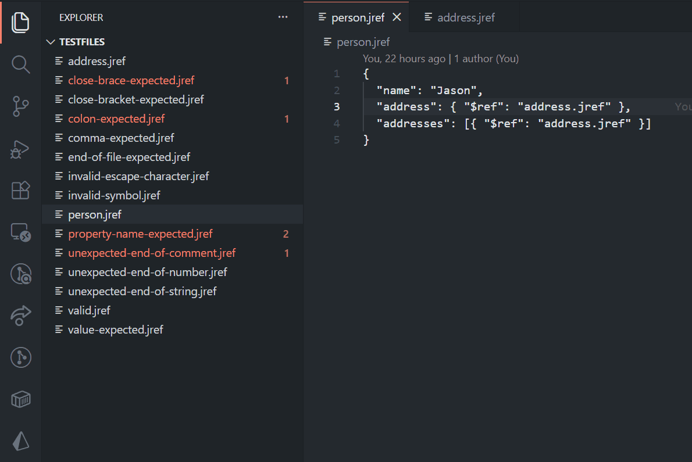
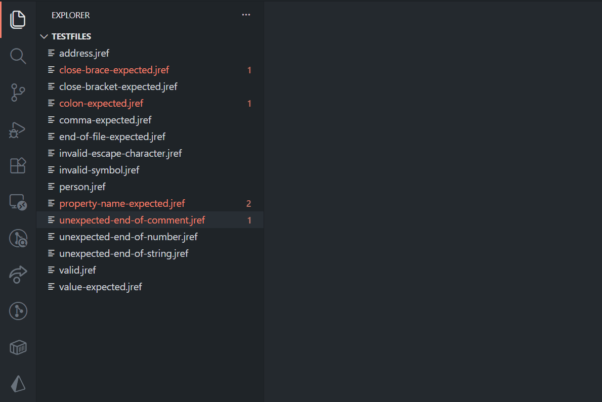

# JRef Language Support (VS Code Extension)


This project is a submission for the JSON Schema organization's Google Summer of Code 2026 [qualification task](https://github.com/json-schema-org/community/issues/991#issuecomment-3961221291)

## Features

### Go to Definition

Navigate to referenced files using `Ctrl+Click` on `$ref` values.



### Diagnostics

Syntax validation and error reporting for malformed JRef structure.



## Requirements

1. Node
2. VS Code

## How to run the extension

1. Clone the repository

```bash
git clone https://github.com/ntoulasm/jref-language-server.git
cd jref-language-server
```

2. Install dependencies

```bash
npm install
```

3. Open VS Code and press `F5` to open a new window with the extension loaded

## Testing Suite

### Integration Tests (`client/src/test`)

These tests use `vscode-test` to simulate a real user environment.

### Unit Tests (`server/src/test`)

These tests use `mocha` to test the server side functionality.

### How to run

```bash
npm run test -w client # client tests only
npm run test -w server # server tests only
npm run test           # both client and server tests
```

## Continuous Integration

This repository uses **GitHub Actions** to ensure code quality on every push and PR.

### Linting

Automated check for code style and formatting.

### Integration Tests

Executes the `vscode-test` suite for headless VS Code testing.

### Unit Tests

Runs the `mocha` suite for the Language Server logic.
